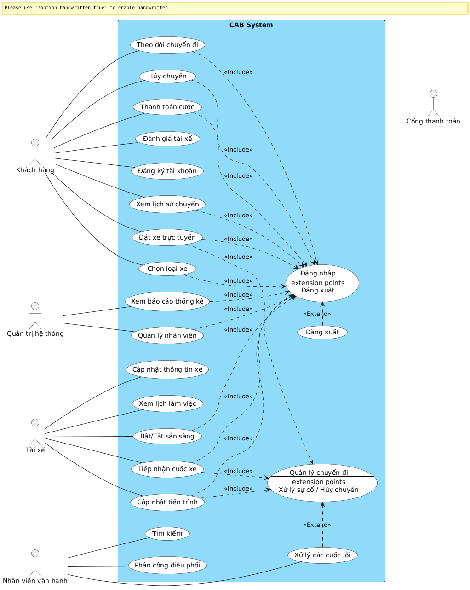

# TÀI LIỆU PHÂN TÍCH YÊU CẦU HỆ THỐNG ĐẶT XE (CAB SYSTEM)

> **Tài liệu kỹ thuật liên quan:**
> - Đặc tả API hệ thống: [api_document.md](api_document.md)
> - Cấu hình OpenAPI Specification: [openapi.yaml](openapi.yaml)

## MỤC LỤC
1. [Vấn đề của hệ thống hiện tại & Câu hỏi làm rõ](#1-vấn-đề-của-hệ-thống-hiện-tại--câu-hỏi-làm-rõ)
2. [Mục tiêu nghiệp vụ](#2-mục-tiêu-nghiệp-vụ)
3. [Phân tích Các bên liên quan (Stakeholders)](#3-phân-tích-các-bên-liên-quan-stakeholders)
4. [Phạm vi dự án trong 7 tuần (MVP)](#4-phạm-vi-dự-án-trong-7-tuần-mvp)
5. [Yêu cầu nghiệp vụ (Business Requirements)](#5-yêu-cầu-nghiệp-vụ-business-requirements)
6. [Yêu cầu chức năng (Functional Requirements)](#6-yêu-cầu-chức-năng-functional-requirements)
7. [Sơ đồ Use Case tổng quát](#7-sơ-đồ-use-case-tổng-quát)
8. [Đặc tả chi tiết Use Case](#8-đặc-tả-chi-tiết-use-case)
9. [Quy trình nghiệp vụ (Business Process)](#9-quy-trình-nghiệp-vụ-business-process)
10. [Quy tắc nghiệp vụ (Business Rules)](#10-quy-tắc-nghiệp-vụ-business-rules)

---

## 1. VẤN ĐỀ CỦA HỆ THỐNG HIỆN TẠI & CÂU HỎI LÀM RÕ

### 1.1. Phân công tài xế còn thủ công
* Hệ thống hiện tại đang phân công tài xế như thế nào?
* Những khó khăn lớn nhất của việc phân công tài xế thủ công là gì?

### 1.2. Khách hàng khó theo dõi trạng thái chuyến đi
* Hiện tại khách hàng có thể theo dõi những thông tin nào về chuyến đi?
* Hệ thống mới cần cung cấp những trạng thái nào cho khách hàng?

### 1.3. Thông tin thanh toán chưa được quản lý tập trung
* Hiện tại doanh nghiệp đang quản lý thông tin và lịch sử thanh toán như thế nào?
* Những vấn đề thường xảy ra trong quá trình quản lý thanh toán là gì?

### 1.4. Khó mở rộng hệ thống
* Hệ thống hiện tại gặp vấn đề gì khi số lượng khách hàng và tài xế tăng cao?
* Doanh nghiệp dự kiến hệ thống mới phải phục vụ bao nhiêu khách hàng và tài xế?

### 1.5. Chưa xác định rõ tiêu chí phân công tài xế
* Hệ thống sẽ ưu tiên tài xế dựa trên những tiêu chí nào?
* Khi có nhiều tài xế cùng phù hợp thì hệ thống sẽ lựa chọn tài xế nào?

### 1.6. Chưa xác định thời gian tài xế phản hồi
* Tài xế có bao nhiêu thời gian để chấp nhận hoặc từ chối chuyến?
* Nếu tài xế không phản hồi thì hệ thống sẽ xử lý như thế nào?

### 1.7. Chưa xác định chính sách hủy chuyến
* Khách hàng và tài xế được phép hủy chuyến trong những trường hợp nào?
* Hủy chuyến có phát sinh phí hay không?
* Nếu tài xế hủy chuyến thì hệ thống có tự động tìm tài xế khác không?

### 1.8. Chưa xác định cách tính cước
* Giá chuyến xe được tính dựa trên những yếu tố nào?
* Có áp dụng giá cao điểm hoặc phụ phí trong một số trường hợp không?

### 1.9. Chưa xác định cách xử lý khi mất kết nối
* Nếu khách hàng hoặc tài xế mất kết nối trong quá trình thực hiện chuyến thì hệ thống xử lý như thế nào?
* Nếu mất kết nối trong lúc thanh toán thì trạng thái giao dịch được xử lý ra sao?

### 1.10. Chưa xác định thời gian lưu trữ dữ liệu
* Dữ liệu khách hàng, tài xế, vị trí và giao dịch cần được lưu trữ trong bao lâu?
* Những dữ liệu nào cần được lưu lâu dài để phục vụ báo cáo và kiểm tra?

---

## 2. MỤC TIÊU NGHIỆP VỤ

* Đáp ứng nhu cầu **đặt xe của số lượng lớn khách hàng**.
* Tự động hóa quá trình **tìm kiếm và phân công tài xế**, giảm sự phụ thuộc vào thao tác thủ công.
* Hỗ trợ khách hàng **đặt xe, theo dõi trạng thái chuyến đi và xem thông tin tài xế**.
* Hỗ trợ **thanh toán bằng hai hình thức: tiền mặt và thanh toán điện tử**.
* Quản lý tập trung thông tin **khách hàng, tài xế, phương tiện, chuyến đi và giao dịch**.
* Hỗ trợ nhân viên vận hành **theo dõi, quản lý và xử lý các vấn đề phát sinh trong chuyến đi**.
* Cung cấp dữ liệu và báo cáo để **đánh giá hiệu quả hoạt động và doanh thu**.
* Đảm bảo hệ thống **ổn định, bảo mật và có khả năng mở rộng** khi số lượng người dùng tăng.
* Tạo nền tảng linh hoạt để **bổ sung dịch vụ, phương thức thanh toán và kênh thông báo mới trong tương lai**.

---

## 3. PHÂN TÍCH CÁC BÊN LIÊN QUAN (STAKEHOLDERS)

### 3.1. Danh sách Stakeholders

| Stakeholder | Vai trò / trách nhiệm |
|---|---|
| **Ban Giám đốc** | Định hướng, phê duyệt và đưa ra các quyết định quan trọng của dự án |
| **Quản lý vận hành** | Quản lý hoạt động đặt xe, tài xế và xử lý các vấn đề phát sinh |
| **Nhân viên vận hành** | Quản lý khách hàng, tài xế, phương tiện và chuyến đi |
| **Khách hàng** | Đăng ký, đặt xe, theo dõi chuyến, thanh toán và đánh giá tài xế |
| **Tài xế** | Nhận chuyến, cập nhật trạng thái, vị trí và hoàn thành chuyến |
| **Nhà cung cấp thanh toán** | Cung cấp dịch vụ thanh toán điện tử |
| **Cơ quan quản lý** | Giám sát việc tuân thủ các quy định liên quan |
| **Nhà cung cấp hạ tầng công nghệ** | Cung cấp và duy trì hạ tầng hệ thống |
| **Nhà cung cấp dịch vụ thông báo** | Cung cấp các kênh SMS, Email và Push Notification |

### 3.2. Ma trận Stakeholders (Stakeholder Matrix)

| Mức độ | Low Interest (Quan tâm thấp) | High Interest (Quan tâm cao) |
|---|---|---|
| **High Power (Quyền lực cao)** | **Keep Satisfied (Làm hài lòng)** • Cơ quan quản lý (Government / Regulatory) • Nhà cung cấp thanh toán (Payment Provider) | **Manage Closely (Quản lý chặt chẽ)** • Ban Giám đốc (Senior Management) • Quản lý vận hành (Operations Manager) |
| **Low Power (Quyền lực thấp)** | **Monitor (Theo dõi)** • Khách hàng tiềm năng (Potential Customers) • Nhà cung cấp hạ tầng (Tech / Infrastructure) • Đối tác quảng cáo (Advertising Partners) | **Keep Informed (Cung cấp thông tin)** • Nhân viên vận hành (Operations Staff) • Khách hàng hiện tại (Customers / Riders) • Tài xế (Drivers) |

---

## 4. PHẠM VI DỰ ÁN TRONG 7 TUẦN (MVP)

Dự án **CAB System** được thực hiện trong **7 tuần**, tập trung xây dựng phiên bản **MVP (Minimum Viable Product)** cho nền tảng đặt xe. Phạm vi ưu tiên các chức năng cốt lõi phục vụ quy trình từ khi khách hàng đặt xe đến khi chuyến đi hoàn thành và thanh toán.

### 4.1. Trong phạm vi (In-Scope)
* **Khách hàng:** Đăng ký, đăng nhập, cập nhật thông tin, đặt xe, theo dõi chuyến đi, xem lịch sử chuyến, hủy chuyến, thanh toán và đánh giá tài xế.
* **Tài xế:** Quản lý thông tin cá nhân và phương tiện, cập nhật trạng thái sẵn sàng, nhận hoặc từ chối chuyến, cập nhật trạng thái và hoàn thành chuyến.
* **Đặt xe và phân công:** Tiếp nhận yêu cầu đặt xe, nhập điểm đón và điểm đến, lựa chọn loại xe, tìm tài xế phù hợp và tiếp tục tìm tài xế khác nếu tài xế từ chối hoặc không phản hồi.
* **Quản lý chuyến đi:** Quản lý toàn bộ vòng đời chuyến đi từ lúc tạo yêu cầu, tìm tài xế, nhận chuyến, thực hiện, hoàn thành hoặc hủy chuyến.
* **Thanh toán:** Tính cước và hỗ trợ hai hình thức thanh toán gồm **tiền mặt và thanh toán điện tử** thông qua nhà cung cấp bên ngoài.
* **Thông báo:** Gửi thông báo về đặt xe, nhận chuyến, tài xế đến điểm đón, hoàn thành chuyến và kết quả thanh toán.
* **Quản lý vận hành:** Cho phép nhân viên vận hành quản lý khách hàng, tài xế, phương tiện, chuyến đi và xử lý các sự cố phát sinh.
* **Báo cáo:** Thống kê số lượng chuyến, doanh thu, tỷ lệ hoàn thành, tỷ lệ hủy và hiệu quả hoạt động của tài xế.
* **Bảo mật:** Xác thực người dùng, phân quyền, bảo vệ dữ liệu và ghi nhận các thao tác quan trọng.

### 4.2. Ngoài phạm vi (Out-of-Scope)
* Định giá động bằng AI/Machine Learning.
* Hệ thống mã giảm giá (Voucher), chương trình khuyến mãi và tích điểm.
* Kênh chat trực tiếp (In-app Chat) giữa khách hàng và tài xế.
* Tự xây dựng hệ thống bản đồ/GPS riêng (sử dụng API có sẵn).
* Tích hợp đồng thời nhiều cổng thanh toán.
* Tích hợp đồng thời nhiều nhà cung cấp SMS/Email gateway.
* Các dịch vụ vận tải khác ngoài dịch vụ chở khách cơ bản.

### 4.3. Kế hoạch thực hiện trong 7 tuần

| Tuần | Nội dung thực hiện |
|---|---|
| **Tuần 1** | Khảo sát hiện trạng, xác định vấn đề, stakeholder và mục tiêu nghiệp vụ |
| **Tuần 2** | Phân tích nghiệp vụ và xây dựng Business Requirements |
| **Tuần 3** | Phân rã Functional Requirements và xây dựng Use Case Diagram |
| **Tuần 4** | Đặc tả chi tiết Use Case và mô hình hóa Business Process |
| **Tuần 5** | Thiết kế cơ sở dữ liệu (ERD) và kiến trúc hệ thống |
| **Tuần 6** | Phát triển và tích hợp các chức năng cốt lõi (Core MVP) |
| **Tuần 7** | Kiểm thử, sửa lỗi, hoàn thiện tài liệu và chuẩn bị nghiệm thu / demo |

---

## 5. YÊU CẦU NGHIỆP VỤ (BUSINESS REQUIREMENTS)

| ID | Yêu cầu nghiệp vụ | Mô tả chi tiết |
|---|---|---|
| **BR01** | Hỗ trợ đặt xe trực tuyến | Cho phép khách hàng tạo và quản lý yêu cầu đặt xe, nhập điểm đón, điểm đến và lựa chọn loại xe. |
| **BR02** | Tự động tìm kiếm và phân công tài xế | Tự động tìm và phân công tài xế phù hợp dựa trên vị trí, trạng thái sẵn sàng và tiêu chí vận hành. |
| **BR03** | Tiếp tục tìm tài xế | Khi tài xế từ chối hoặc không phản hồi, hệ thống tiếp tục tìm tài xế khác mà không yêu cầu khách hàng đặt lại. |
| **BR04** | Theo dõi chuyến đi | Cho phép khách hàng theo dõi trạng thái và thông tin chuyến đi từ lúc đặt xe đến khi hoàn thành. |
| **BR05** | Quản lý tài xế và phương tiện | Hỗ trợ quản lý thông tin tài xế, phương tiện và trạng thái hoạt động của tài xế. |
| **BR06** | Quản lý chuyến đi | Quản lý toàn bộ vòng đời chuyến đi: tạo yêu cầu, tìm tài xế, nhận chuyến, thực hiện, hoàn thành hoặc hủy chuyến. |
| **BR07** | Tính cước và thanh toán | Xác định số tiền khách hàng cần thanh toán dựa trên loại dịch vụ và thông tin chuyến đi. |
| **BR08** | Hỗ trợ nhiều hình thức thanh toán | Hỗ trợ thanh toán bằng tiền mặt và thanh toán điện tử thông qua nhà cung cấp bên ngoài. |
| **BR09** | Quản lý thông báo | Gửi thông báo cho khách hàng và tài xế về các sự kiện quan trọng trong quá trình đặt và thực hiện chuyến đi. |
| **BR10** | Quản lý vận hành | Cung cấp giao diện quản trị để nhân viên vận hành quản lý khách hàng, tài xế, phương tiện và chuyến đi. |
| **BR11** | Hỗ trợ xử lý sự cố | Cho phép nhân viên vận hành theo dõi và hỗ trợ xử lý các vấn đề liên quan đến chuyến đi hoặc giao dịch. |
| **BR12** | Báo cáo và theo dõi hoạt động | Cung cấp báo cáo về số chuyến, doanh thu, tỷ lệ hoàn thành, tỷ lệ hủy và hiệu quả hoạt động của tài xế. |
| **BR13** | Đảm bảo bảo mật | Bảo vệ thông tin cá nhân, thông tin phương tiện, dữ liệu vị trí và dữ liệu giao dịch. |
| **BR14** | Kiểm soát quyền truy cập | Phân quyền người dùng và nhân viên, đảm bảo các chức năng quản trị nhạy cảm chỉ được thực hiện bởi người có quyền. |
| **BR15** | Ghi nhận lịch sử hoạt động | Lưu vết các thao tác quan trọng để phục vụ kiểm tra, giám sát và xử lý sự cố. |
| **BR16** | Đảm bảo khả năng mở rộng | Có khả năng phục vụ số lượng lớn khách hàng và tài xế, đồng thời cho phép mở rộng độc lập các thành phần khi nhu cầu tăng. |
| **BR17** | Đảm bảo tính liên tục của dịch vụ | Hạn chế ảnh hưởng khi một thành phần như thanh toán hoặc thông báo gặp lỗi, tránh làm gián đoạn toàn bộ chức năng đặt xe. |
| **BR18** | Hỗ trợ phát triển trong tương lai | Cho phép bổ sung loại dịch vụ, phương thức thanh toán, nhà cung cấp thông báo và thay đổi thành phần kỹ thuật mà không cần xây dựng lại toàn bộ hệ thống. |

---

## 6. YÊU CẦU CHỨC NĂNG (FUNCTIONAL REQUIREMENTS)

| ID | Yêu cầu chức năng | Mô tả chức năng | Ánh xạ BR |
|---|---|---|---|
| **FR01** | Đặt xe trực tuyến | Hệ thống cho phép khách hàng tạo và quản lý yêu cầu đặt xe, bao gồm điểm đón, điểm đến và loại xe. | BR01 |
| **FR02** | Tìm kiếm và phân công tài xế | Hệ thống tự động tìm kiếm và phân công tài xế phù hợp dựa trên vị trí, trạng thái sẵn sàng và tiêu chí vận hành. | BR02 |
| **FR03** | Tiếp tục tìm tài xế | Hệ thống tiếp tục tìm tài xế khác khi tài xế được đề xuất từ chối hoặc không phản hồi. | BR03 |
| **FR04** | Theo dõi chuyến đi | Hệ thống cho phép khách hàng theo dõi trạng thái và thông tin chuyến đi từ khi đặt xe đến khi hoàn thành. | BR04 |
| **FR05** | Quản lý tài xế và phương tiện | Hệ thống hỗ trợ quản lý thông tin tài xế, phương tiện và trạng thái hoạt động của tài xế. | BR05 |
| **FR06** | Quản lý chuyến đi | Hệ thống quản lý toàn bộ vòng đời chuyến đi, từ tạo yêu cầu, tìm tài xế, nhận chuyến, thực hiện đến hoàn thành hoặc hủy chuyến. | BR06 |
| **FR07** | Tính cước | Hệ thống xác định số tiền khách hàng cần thanh toán dựa trên loại dịch vụ và thông tin chuyến đi. | BR07 |
| **FR08** | Xử lý thanh toán | Hệ thống hỗ trợ thanh toán bằng tiền mặt và thanh toán điện tử thông qua nhà cung cấp thanh toán bên ngoài. | BR08 |
| **FR09** | Quản lý thông báo | Hệ thống gửi thông báo cho khách hàng và tài xế về các sự kiện quan trọng trong quá trình đặt và thực hiện chuyến đi. | BR09 |
| **FR10** | Quản lý vận hành | Hệ thống cung cấp giao diện quản trị để nhân viên vận hành quản lý khách hàng, tài xế, phương tiện và chuyến đi. | BR10 |
| **FR11** | Xử lý sự cố | Hệ thống cho phép nhân viên vận hành theo dõi và hỗ trợ xử lý các trường hợp chuyến đi hoặc giao dịch gặp vấn đề. | BR11 |
| **FR12** | Báo cáo và theo dõi hoạt động | Hệ thống cung cấp báo cáo về số lượng chuyến, doanh thu, tỷ lệ hoàn thành, tỷ lệ hủy và hiệu quả hoạt động của tài xế. | BR12 |

---

## 7. SƠ ĐỒ USE CASE TỔNG QUÁT

*(Lưu ý: Đổi tên file ảnh thành `usecase.jpg` đặt trong thư mục `images/` để đường dẫn luôn hoạt động chính xác)*

---

## 8. ĐẶC TẢ CHI TIẾT USE CASE

### 8.1. Đặc tả Use Case Đặt xe

| Thuộc tính | Nội dung |
|---|---|
| **– Tên use case:** | Đặt xe (Tạo chuyến đi) |
| **– Mô tả sơ lược:** | Chức năng cho phép khách hàng chọn điểm đón, điểm đến, chọn loại xe và gửi yêu cầu đặt xe lên hệ thống. |
| **– Actor chính:** | Khách hàng |
| **– Actor phụ:** | Không |
| **– Tiền điều kiện:** | Khách hàng đã đăng nhập tài khoản vào ứng dụng thành công. |
| **– Hậu điều kiện:** | Hệ thống tạo chuyến đi mới, chuyển sang trạng thái tìm kiếm tài xế lân cận. |

| Actor: Khách hàng | System |
|---|---|
| 1. Nhập điểm đón và điểm đến trên ứng dụng. | 2. Hiển thị lộ trình dự kiến, danh sách các loại xe và giá tiền ước tính. |
| 3. Chọn loại xe mong muốn và nhấn nút "Đặt xe". | 4. Kiểm tra tính hợp lệ của thông tin chuyến đi. |
| | 5. Khởi tạo cuốc xe mới với trạng thái `FINDING_DRIVER`. |
| | 6. Hiển thị màn hình chờ và kích hoạt tiến trình tìm kiếm tài xế phù hợp. |

**Luồng sự kiện thay thế:**
* **3.1.** Khách hàng nhấn "Hủy tìm kiếm" khi hệ thống đang tìm tài xế:
  * **3.2.** Hệ thống hủy yêu cầu tìm kiếm và đưa khách hàng quay lại màn hình chính.

**Luồng sự kiện ngoại lệ:**
* **1.1.** Địa chỉ đón hoặc đến nằm ngoài phạm vi phục vụ:
  * **1.2.** Hệ thống hiển thị thông báo "Khu vực chưa được hỗ trợ", yêu cầu chọn lại địa chỉ.
* **6.1.** Hết thời gian tìm kiếm mà không có tài xế nào nhận chuyến:
  * **6.2.** Hệ thống hiển thị thông báo "Không tìm thấy tài xế, vui lòng thử lại sau". Kết thúc use case.

---

### 8.2. Đặc tả Use Case Tiếp nhận chuyến đi

| Thuộc tính | Nội dung |
|---|---|
| **– Tên use case:** | Tiếp nhận hoặc từ chối chuyến đi |
| **– Mô tả sơ lược:** | Chức năng cho phép tài xế xem trước thông tin cuốc xe được điều phối và lựa chọn nhận hoặc từ chối. |
| **– Actor chính:** | Tài xế |
| **– Actor phụ:** | Dịch vụ thông báo |
| **– Tiền điều kiện:** | Tài xế đang đăng nhập, bật trạng thái sẵn sàng làm việc (`ONLINE`) và không có chuyến đi dở dang. |
| **– Hậu điều kiện:** | Chuyến đi được gán cho tài xế và chuyển sang trạng thái bắt đầu đón khách. |

| Actor: Tài xế | System |
|---|---|
| | 1. Đổ chuông thông báo, hiển thị màn hình cuốc xe mới (điểm đón, khoảng cách, loại xe) và đồng hồ đếm ngược 15 giây. |
| 2. Nhấn nút "Nhận chuyến". | 3. Kiểm tra tính khả dụng của chuyến đi. |
| | 4. Gán tài xế vào chuyến đi, cập nhật trạng thái chuyến thành `DRIVER_ASSIGNED`. |
| | 5. Chuyển trạng thái tài xế sang `BUSY` (bận). |
| | 6. Hiển thị bản đồ chỉ đường đến điểm đón; gửi thông báo thông tin tài xế cho khách hàng. |

**Luồng sự kiện thay thế:**
* **2.1.** Tài xế nhấn nút "Từ chối":
  * **2.2.** Hệ thống ghi nhận tài xế từ chối và tự động chuyển cuốc xe sang tài xế phù hợp tiếp theo mà khách không phải đặt lại.

**Luồng sự kiện ngoại lệ:**
* **1.1.** Hết 15 giây đếm ngược mà tài xế không phản hồi:
  * **1.2.** Hệ thống tự động ghi nhận là "Bỏ lỡ chuyến" và tự động điều phối cho tài xế khác.

---

### 8.3. Đặc tả Use Case Cập nhật tiến trình chuyến đi

| Thuộc tính | Nội dung |
|---|---|
| **– Tên use case:** | Cập nhật tiến trình chuyến đi |
| **– Mô tả sơ lược:** | Cho phép tài xế cập nhật từng mốc trạng thái của chuyến xe từ lúc đến điểm hẹn cho tới khi trả khách xong. |
| **– Actor chính:** | Tài xế |
| **– Actor phụ:** | Khách hàng |
| **– Tiền điều kiện:** | Chuyến đi đang ở trạng thái đã gán tài xế (`DRIVER_ASSIGNED`). |
| **– Hậu điều kiện:** | Chuyến đi hoàn tất, hệ thống tự động khóa sổ lộ trình và tính tiền. |

| Actor: Tài xế | System |
|---|---|
| 1. Lái xe đến điểm đón và nhấn nút "Đã đến điểm đón". | 2. Cập nhật trạng thái `ARRIVED_AT_PICKUP`, gửi thông báo cho khách hàng ra xe. |
| 3. Khách lên xe, tài xế nhấn "Bắt đầu chuyến đi". | 4. Cập nhật trạng thái `IN_PROGRESS`, bắt đầu tính thời gian và quãng đường thực tế. |
| 5. Chở khách đến điểm đến và nhấn "Hoàn thành chuyến". | 6. Cập nhật trạng thái `COMPLETED`, tính toán cước phí và chuyển sang màn hình thu tiền. |

**Luồng sự kiện ngoại lệ:**
* **1.1.** Tài xế chờ quá 10 phút tại điểm đón mà khách không xuất hiện: Tài xế nhấn nút "Hủy chuyến - Khách vắng mặt".
  * **1.2.** Hệ thống kiểm tra tọa độ GPS của tài xế xác nhận đúng điểm hẹn, ghi nhận hủy cuốc theo chính sách và mở lại trạng thái `ONLINE` cho tài xế.

---

### 8.4. Đặc tả Use Case Thanh toán chuyến đi

| Thuộc tính | Nội dung |
|---|---|
| **– Tên use case:** | Thanh toán chuyến đi |
| **– Mô tả sơ lược:** | Khách hàng thực hiện thanh toán chi phí di chuyển qua tiền mặt hoặc cổng thanh toán điện tử. |
| **– Actor chính:** | Khách hàng |
| **– Actor phụ:** | Cổng thanh toán (Payment Gateway), Tài xế |
| **– Tiền điều kiện:** | Chuyến đi vừa chuyển sang trạng thái `COMPLETED` và cước phí đã được tính. |
| **– Hậu điều kiện:** | Hóa đơn được thanh toán thành công và lưu vào lịch sử giao dịch. |

| Actor: Khách hàng | System |
|---|---|
| | 1. Hiển thị bảng kê chi tiết cước phí và các tùy chọn thanh toán. |
| 2. Chọn hình thức Ví điện tử / Thẻ thanh toán và nhấn "Xác nhận thanh toán". | 3. Gửi yêu cầu trừ tiền kèm mã giao dịch an toàn sang Cổng thanh toán (không lưu thông tin thẻ). |
| | 4. Cổng thanh toán xử lý và phản hồi giao dịch thành công. |
| | 5. Cập nhật trạng thái hóa đơn là `PAID`, gửi biên lai điện tử cho khách hàng và tài xế. |
| 6. Chấm điểm sao (1 - 5 sao), để lại nhận xét và nhấn "Gửi". | 7. Lưu đánh giá vào hồ sơ tài xế và đóng phiên chuyến đi. |

**Luồng sự kiện thay thế:**
* **2.1.** Khách hàng chọn phương thức "Tiền mặt":
  * **2.2.** Hệ thống hiển thị số tiền mặt cần thu trên màn hình của tài xế.
  * **2.3.** Tài xế nhận tiền mặt từ khách và nhấn nút "Đã thu tiền".
  * **2.4.** Hệ thống cập nhật hóa đơn là `PAID` bằng tiền mặt và chuyển đến bước 6.

**Luồng sự kiện ngoại lệ:**
* **4.1.** Cổng thanh toán báo lỗi (không đủ số dư, thẻ hết hạn, lỗi mạng kết nối):
  * **4.2.** Khách hàng nhận thông báo thất bại, chọn "Thử lại" hoặc "Đổi sang thanh toán tiền mặt".
  * **4.3.** Hệ thống xử lý tiếp theo lựa chọn của khách hàng.

---

### 8.5. Đặc tả Use Case Giám sát và Xử lý sự cố chuyến đi

| Thuộc tính | Nội dung |
|---|---|
| **– Tên use case:** | Giám sát và Xử lý sự cố chuyến đi |
| **– Mô tả sơ lược:** | Hỗ trợ nhân viên vận hành theo dõi, xử lý thủ công các chuyến đi gặp sự cố hoặc giải quyết khiếu nại. |
| **– Actor chính:** | Nhân viên vận hành |
| **– Actor phụ:** | Không |
| **– Tiền điều kiện:** | Nhân viên vận hành đăng nhập tài khoản quản trị thành công và có quyền điều hành. |
| **– Hậu điều kiện:** | Trạng thái chuyến đi được can thiệp thành công, lưu lại toàn bộ vết thao tác (Audit Log). |

| Actor: Nhân viên vận hành | System |
|---|---|
| 1. Truy cập vào trang giám sát các chuyến đi đang hoạt động. | 2. Hiển thị danh sách chuyến xe kèm các cảnh báo bất thường (treo quá lâu, mất tín hiệu GPS). |
| 3. Nhấp chọn vào chuyến đi đang gặp lỗi. | 4. Hiển thị thông tin chi tiết: khách hàng, tài xế, lịch sử trạng thái và tọa độ GPS gần nhất. |
| 5. Chọn thao tác can thiệp (Hủy chuyến khẩn cấp / Đổi tài xế / Điều chỉnh cước phí). | 6. Hiển thị ô nhập lý do can thiệp. |
| 7. Nhập lý do xử lý và nhấn nút "Xác nhận can thiệp". | 8. Cập nhật trạng thái mới cho chuyến đi, ghi lại nhật ký thao tác (ID nhân viên, thời gian, hành động, lý do) vào Audit Log. |

**Luồng sự kiện ngoại lệ:**
* **7.1.** Nhân viên nhấn xác nhận nhưng bỏ trống lý do:
  * **7.2.** Hệ thống hiển thị cảnh báo "Bắt buộc phải nhập lý do xử lý sự cố để lưu vết kiểm toán". Quay lại bước 6.

---

## 9. QUY TRÌNH NGHIỆP VỤ (BUSINESS PROCESS)

### 9.1. Vòng đời tổng thể của chuyến đi (End-to-End Ride Lifecycle)

| Bước | Thực hiện bởi | Hành động nghiệp vụ | Trạng thái chuyến đi |
|:---|:---|:---|:---|
| **BP01.1** | Khách hàng | Mở app, chọn điểm đón, điểm trả và loại dịch vụ xe. Bấm "Đặt xe". | `FINDING_DRIVER` |
| **BP01.2** | Hệ thống | Quét tọa độ GPS, lập danh sách tài xế `ONLINE` gần nhất và phát cuốc xe theo thứ tự ưu tiên. | `DISPATCHING` |
| **BP01.3** | Tài xế | Xem thông tin chuyến và bấm "Chấp nhận" trong vòng 15 giây. | `DRIVER_ASSIGNED` |
| **BP01.4** | Tài xế | Di chuyển đến đón khách và bấm "Đã đến nơi". | `ARRIVED_AT_PICKUP` |
| **BP01.5** | Tài xế | Đón khách lên xe và bấm "Bắt đầu chuyến đi". | `IN_PROGRESS` |
| **BP01.6** | Tài xế | Chở khách đến điểm trả và bấm "Hoàn thành chuyến". | `COMPLETED` |
| **BP01.7** | Hệ thống | Khóa lộ trình, tính toán cước phí thực tế dựa trên bảng giá và quãng đường. | `UNPAID` |
| **BP01.8** | Khách / Cổng TT | Thanh toán qua Cổng thanh toán hoặc trả tiền mặt cho tài xế. | `PAID` |
| **BP01.9** | Khách hàng | Chấm điểm sao (1-5 sao) và để lại phản hồi về chuyến đi. | `CLOSED` |

---

### 9.2. Quy trình Điều phối & Ghép nối tài xế (Matching Process)

| STT | Bên liên quan | Thao tác thực hiện | Xử lý ngoại lệ / Rẽ nhánh |
|:---|:---|:---|:---|
| **1** | Hệ thống | Tiếp nhận yêu cầu từ khách hàng; xác định bán kính tìm kiếm (3 km - 5 km). | Nếu không có tài xế nào `ONLINE`: Báo lỗi không tìm thấy xe. |
| **2** | Hệ thống | Sắp xếp độ ưu tiên của tài xế: Khoảng cách gần nhất, đánh giá sao cao, tỷ lệ nhận chuyến tốt. | Chọn tài xế đứng đầu danh sách ưu tiên. |
| **3** | Hệ thống & Tài xế | Gửi thông báo chuyến đi đến tài xế ưu tiên kèm bộ đếm ngược 15 giây. | • **Nếu tài xế từ chối:** Chuyển ngay sang tài xế tiếp theo. • **Nếu quá 15s không phản hồi:** Đánh dấu bỏ lỡ, chuyển sang tài xế tiếp theo. |
| **4** | Tài xế | Bấm "Chấp nhận" chuyến đi. | Chuyển trạng thái tài xế sang `BUSY` để không nhận thêm cuốc khác. |
| **5** | Hệ thống | Gửi thông báo xác nhận ghép chuyến thành công cho khách hàng kèm thông tin xe và tài xế. | Khách hàng bấm theo dõi xe di chuyển trên bản đồ. |

---

### 9.3. Quy trình Thực hiện chuyến đi & Cập nhật vị trí (Trip Execution & Tracking)

| STT | Bên liên quan | Thao tác thực hiện | Quy định nghiệp vụ |
|:---|:---|:---|:---|
| **1** | Tài xế | Bật định vị GPS liên tục, di chuyển tới điểm đón của khách. | Ứng dụng gửi tọa độ GPS về hệ thống mỗi 3-5 giây. |
| **2** | Hệ thống | Ước tính thời gian đến (ETA) và cập nhật đường đi của xe trên màn hình khách hàng. | Cập nhật vị trí real-time trên bản đồ. |
| **3** | Tài xế | Đến điểm đón, bấm "Đã đến điểm đón". Khách hàng nhận chuông thông báo xe đã tới. | Quá 10 phút khách không ra và không nghe máy: Tài xế được quyền hủy chuyến hợp lệ. |
| **4** | Tài xế | Khách lên xe, tài xế xác nhận điểm đến và bấm "Bắt đầu chuyến đi". | Đồng hồ cước bắt đầu ghi nhận dữ liệu thực tế. |
| **5** | Tài xế | Lái xe trả khách tại điểm đến, bấm "Hoàn thành chuyến đi". | Khóa hành trình và tự động kích hoạt tính tiền. |

---

### 9.4. Quy trình Tính cước & Xử lý thanh toán (Fare Calculation & Payment)

| STT | Bên liên quan | Thao tác thực hiện | Phương thức xử lý |
|:---|:---|:---|:---|
| **1** | Hệ thống | Thu thập dữ liệu thực tế (quãng đường GPS, thời gian di chuyển, loại xe, phụ phí cao điểm nếu có) để ra số tiền cuối cùng. | Hiển thị bảng kê chi tiết cước phí lên màn hình khách và tài xế. |
| **2A** | Khách / Tài xế | **Thanh toán tiền mặt:** Khách đưa tiền theo màn hình hiển thị; tài xế nhận đủ tiền và bấm "Xác nhận đã thu đủ". | Hệ thống cập nhật hóa đơn sang `PAID`. |
| **2B** | Khách / Cổng TT | **Thanh toán điện tử:** Khách chọn Cổng thanh toán (Tokenization/Redirect); cổng trừ tiền thành công. | Hệ thống cập nhật hóa đơn sang `PAID`. |
| **3** | Hệ thống | Gửi hóa đơn điện tử qua thông báo ứng dụng/email cho khách hàng. | Nếu thanh toán điện tử lỗi: Cho phép thử lại hoặc đổi sang trả tiền mặt. |

---

### 9.5. Quy trình Quản trị & Xử lý sự cố vận hành (Operation & Incident Handling)

| STT | Bên liên quan | Thao tác thực hiện | Nhật ký kiểm toán (Audit Trail) |
|:---|:---|:---|:---|
| **1** | Hệ thống | Quét định kỳ và kích hoạt cảnh báo chuyến bất thường (treo quá lâu, mất GPS > 15 phút, khách gọi khiếu nại). | Gắn cờ cảnh báo đỏ trên Dashboard quản trị. |
| **2** | Nhân viên vận hành | Mở Dashboard, chọn chuyến đi có cờ cảnh báo để kiểm tra lịch sử cuốc xe và vị trí cuối cùng. | Dữ liệu hiển thị ở chế độ chỉ đọc (Read-only). |
| **3** | Nhân viên vận hành | Liên hệ xác minh với tài xế/khách hàng qua điện thoại. | Ghi nhận ghi chú sự cố vào hệ thống. |
| **4** | Nhân viên vận hành | Thực hiện thao tác can thiệp: Hủy chuyến bắt buộc, phân công lại tài xế khác hoặc điều chỉnh cước phí. | Bắt buộc nhập lý do can thiệp vào form xác nhận. |
| **5** | Hệ thống | Lưu vết thao tác vào nhật ký kiểm toán. | Lưu dữ liệu bất biến: Operator ID, mã chuyến, hành động, thời gian và lý do. |

---

## 10. QUY TẮC NGHIỆP VỤ (BUSINESS RULES)

### 10.1. Quy tắc Điều phối và Ghép tài xế (Dispatch Rules)

| Mã luật | Tên quy tắc | Mô tả chi tiết |
|:---|:---|:---|
| **RULE-DIS-01** | Điều kiện tài xế nhận cuốc | Tài xế chỉ được tham gia thuật toán ghép cuốc khi: tài khoản đang hoạt động (`ACTIVE`), trạng thái làm việc là `ONLINE`, hồ sơ xe hợp lệ và không bận chuyến (`status != BUSY`). |
| **RULE-DIS-02** | Bán kính quét tìm tài xế | Hệ thống quét tài xế theo bán kính tăng dần: khởi đầu 3 km quanh điểm đón; nếu không có ai, mở rộng tối đa lên 5 km. |
| **RULE-DIS-03** | Tiêu chí ưu tiên phân cuốc | Danh sách tài xế được xếp thứ tự ưu tiên dựa trên: khoảng cách đến điểm đón gần nhất, điểm đánh giá trung bình cao nhất (Rating >= 4.5) và tỷ lệ nhận cuốc (Acceptance Rate) cao nhất. |
| **RULE-DIS-04** | Thời hạn phản hồi cuốc xe | Mỗi tài xế nhận được lời mời có đúng **15 giây** để bấm "Chấp nhận". Quá thời gian này, hệ thống coi như "Bỏ lỡ chuyến" và tự động chuyển sang tài xế tiếp theo. |
| **RULE-DIS-05** | Giới hạn số lượt tìm kiếm | Hệ thống thực hiện tối đa 3 vòng quét hoặc tối đa 5 tài xế liên tiếp từ chối/bỏ lỡ. Vượt ngưỡng này, hệ thống tự động hủy tiến trình và báo `NO_DRIVER_FOUND` cho khách. |

---

### 10.2. Quy tắc Tính cước và Phụ phí (Fare Calculation Rules)

| Mã luật | Tên quy tắc | Mô tả chi tiết |
|:---|:---|:---|
| **RULE-FAR-01** | Công thức tính cước cơ bản | Cước phí = Giá mở cửa + (Quãng đường thực tế × Đơn giá/km) + (Thời gian di chuyển thực tế × Đơn giá/phút). Đơn giá quy định theo từng hạng xe. |
| **RULE-FAR-02** | Hệ số cước giờ cao điểm (Surge) | Khi số yêu cầu đặt xe tại khu vực vượt quá số tài xế sẵn sàng theo tỷ lệ quy định (nhu cầu/tài xế > 2), tự động áp dụng hệ số nhân giá từ 1.2x đến tối đa 2.0x. |
| **RULE-FAR-03** | Khóa cước tạm tính (Upfront Fare) | Mức giá hiển thị khi khách đặt xe là mức tạm tính dựa trên lộ trình chuẩn. Giá chỉ thay đổi nếu khách đổi điểm đến giữa đường hoặc thời gian kẹt xe/chờ đợi vượt quá 15 phút so với ước tính ban đầu. |

---

### 10.3. Quy tắc Hủy chuyến và Phí phạt (Cancellation Rules)

| Mã luật | Tên quy tắc | Mô tả chi tiết |
|:---|:---|:---|
| **RULE-CAN-01** | Khách hàng miễn phí hủy | Khách hàng được hủy chuyến miễn phí nếu thực hiện trong vòng **2 phút** kể từ lúc tài xế nhận chuyến, hoặc khi thời gian tài xế đến trễ hơn ETA dự tính từ 10 phút trở lên. |
| **RULE-CAN-02** | Phí hủy chuyến đối với khách | Khách hàng hủy chuyến sau 2 phút hoặc khi tài xế đã đến điểm đón mà không liên lạc được khách sẽ bị tính phí hủy (10.000 - 15.000 VNĐ), trừ vào thẻ hoặc cộng vào cuốc tiếp theo. |
| **RULE-CAN-03** | Điều kiện tài xế hủy hợp lệ | Tài xế chỉ được hủy chuyến hợp lệ khi: đã đến đúng tọa độ điểm đón (sai số GPS <= 100m), đã bấm "Đã đến nơi" và đã chờ tối thiểu **10 phút** mà khách không xuất hiện/không nghe máy. |
| **RULE-CAN-04** | Chế tài tài xế hủy tùy tiện | Tài xế tự ý hủy chuyến khi chưa đủ điều kiện quá 3 lần/ngày sẽ bị tạm khóa quyền nhận chuyến (chuyển sang `OFFLINE`) trong 60 phút. |

---

### 10.4. Quy tắc Thanh toán và Bảo mật (Payment & Security Rules)

| Mã luật | Tên quy tắc | Mô tả chi tiết |
|:---|:---|:---|
| **RULE-PAY-01** | Chuẩn bảo mật thẻ (PCI-DSS) | Hệ thống tuyệt đối không lưu trữ thông tin nhạy cảm của thẻ thanh toán (CVV/CVC, toàn bộ 16 số thẻ). Giao dịch được mã hóa định danh (Tokenization) qua Cổng thanh toán. |
| **RULE-PAY-02** | Xử lý sự cố cổng thanh toán | Cổng thanh toán báo lỗi được phép thử lại tối đa 3 lần. Nếu vẫn thất bại, hệ thống tự động đổi phương thức thanh toán của chuyến đi sang **Tiền mặt**. |
| **RULE-PAY-03** | Cấn trừ hoa hồng tài xế | Đối với các chuyến thu tiền mặt, phí hoa hồng chiết khấu nền tảng (ví dụ: 20%) sẽ tự động trừ trực tiếp vào tài khoản ví ký quỹ (Driver Wallet) của tài xế ngay khi cuốc xe hoàn tất. |

---

### 10.5. Quy tắc Vận hành và Giám sát (Operational Rules)

| Mã luật | Tên quy tắc | Mô tả chi tiết |
|:---|:---|:---|
| **RULE-OPS-01** | Lưu vết kiểm toán (Audit Trail) | Mọi thao tác can thiệp dữ liệu thủ công từ nhân viên vận hành (hủy chuyến, sửa cước, khóa tài khoản, hoàn tiền) bắt buộc phải nhập lý do và được ghi log bất biến. |
| **RULE-OPS-02** | Phân quyền truy cập (RBAC) | Nhân viên hỗ trợ (Support) chỉ có quyền xem dữ liệu; Quản trị viên cấp cao (Admin/Supervisor) mới có quyền can thiệp dòng tiền, hoàn cước hoặc mở khóa tài khoản. |
| **RULE-OPS-03** | Cảnh báo mất kết nối GPS | Nếu xe đang trong hành trình (`IN_PROGRESS`) bị mất tín hiệu GPS quá **5 phút**, hệ thống phải kích hoạt cờ cảnh báo đỏ trên màn hình giám sát để nhân viên hỗ trợ gọi xác minh an toàn. |