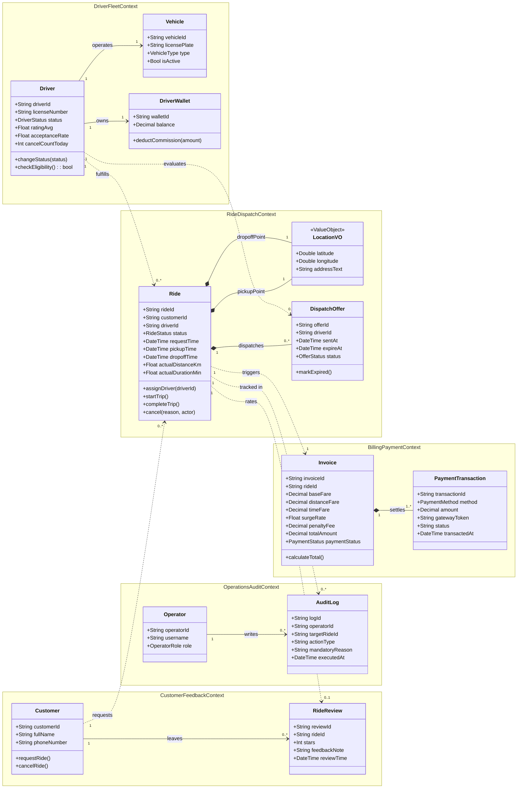
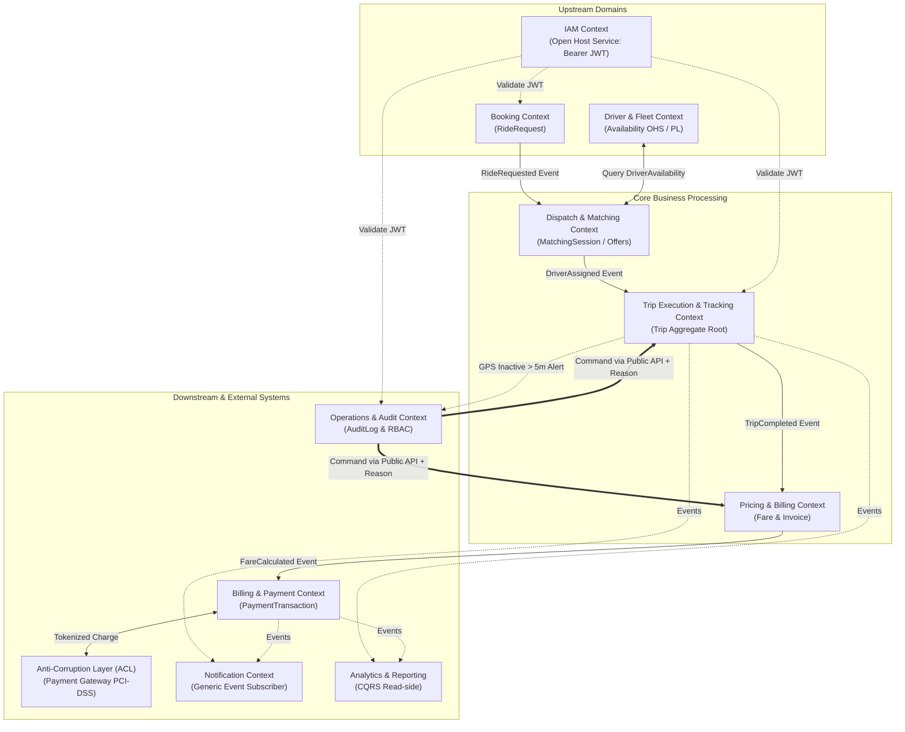

# TÀI LIỆU THIẾT KẾ MIỀN & PHÂN RÃ DDD (DOMAIN ANALYSIS & DECOMPOSITION)
**Hệ thống đặt xe trực tuyến (CAB System)**

> **Tài liệu tham chiếu:**
> - Tài liệu phân tích yêu cầu: [README.md](../README.md)
> - Đặc tả API hệ thống: [api_document.md](../api_document.md)
> - Cấu hình OpenAPI Specification: [openapi.yaml](../openapi.yaml)
> - Sơ đồ kiến trúc miền: [images/domain.png](../images/domain.png)

---

## 1. NGUYÊN TẮC THIẾT KẾ VÀ PHÂN RÃ DDD

Thiết kế kiến trúc miền cho hệ thống **CAB System** được xây dựng dựa trên phương pháp luận **Domain-Driven Design (DDD)** nhằm đáp ứng hai mục tiêu kiến trúc cốt lõi đã đề ra trong tài liệu phân tích yêu cầu:
1. **Khả năng mở rộng độc lập (BR16):** Cho phép các phân hệ nghiệp vụ có thể tăng tải, mở rộng hoặc thay đổi công nghệ mà không làm xáo trộn toàn bộ hệ thống.
2. **Tính liên tục của dịch vụ (BR17):** Hạn chế tối đa hiện tượng "chết chùm" (Cascading Failures) — khi một thành phần như thanh toán, thông báo hay quản lý tài xế gặp lỗi, các thành phần khác vẫn duy trì hoạt động bình thường.

### 1.1. Tiêu chí High Cohesion (Cố kết nội bộ cao)
Mỗi **Bounded Context (BC)** được gom nhóm xoay quanh một cụm trách nhiệm duy nhất (Single Responsibility Principle ở cấp độ hệ thống). Toàn bộ thực thể (Entities), đối tượng giá trị (Value Objects) và quy tắc nghiệp vụ (Business Rules) bên trong một Context đều cùng thay đổi vì một lý do nghiệp vụ duy nhất.

### 1.2. Tiêu chí Loose Coupling (Liên kết lỏng lẻo)
Các Bounded Context hoạt động độc lập tuyệt đối theo nguyên tắc:
* **Không chia sẻ cơ sở dữ liệu (Database-per-Context):** Không sử dụng Foreign Key trỏ trực tiếp xuyên database. Các Context liên kết với nhau thông qua **Mã định danh tham chiếu (Identity Reference)** (ví dụ: `driverId`, `rideId`, `customerId`).
* **Giao tiếp qua Domain Events:** Các tiến trình nghiệp vụ xuyên Context giao tiếp chủ yếu qua cơ chế phát và lắng nghe sự kiện miền bất đồng bộ (Asynchronous Event-Driven).
* **Bọc hệ thống ngoài bằng Anti-Corruption Layer (ACL):** Các dịch vụ bên ngoài (Payment Gateway, SMS/Email Provider) được cách ly để tránh làm ô nhiễm mô hình nghiệp vụ nội bộ.

---

## 2. PHÂN LOẠI SUBDOMAIN CHIẾN LƯỢC

Hệ thống được phân rã thành 3 nhóm Subdomain chiến lược:

| Phân loại | Subdomain | FR phụ trách | Vai trò & Lý do phân loại |
|:---|:---|:---|:---|
| 🔴 **Core Subdomain** *(Cốt lõi)* | **Dispatch & Matching** *(Điều phối & Ghép xe)* | FR02, FR03 | Là giá trị cạnh tranh cốt lõi. Chịu trách nhiệm thực thi thuật toán quét bán kính 3–5 km (`RULE-DIS-02`), tính điểm ưu tiên (`RULE-DIS-03`), đếm ngược 15 giây (`RULE-DIS-04`) và cơ chế thử lại tối đa 5 tài xế (`RULE-DIS-05`). |
| 🔴 **Core Subdomain** *(Cốt lõi)* | **Trip Execution & Tracking** *(Vòng đời & Giám sát chuyến)* | FR04, FR06 | Trực tiếp tạo ra trải nghiệm sản phẩm. Quản lý trạng thái chuyến đi thời gian thực, đồng bộ GPS mỗi 3–5 giây, giám sát mất kết nối GPS quá 5 phút (`RULE-OPS-03`), và kiểm soát điều kiện hủy hợp lệ (`RULE-CAN-01`, `RULE-CAN-03`). |
| 🔴 **Core Subdomain** *(Cốt lõi)* | **Pricing** *(Tính cước phí)* | FR07 | Chuyên trách chiến lược doanh thu: công thức tính cước cơ bản theo km/phút (`RULE-FAR-01`), hệ số giá cao điểm Surge 1.2x – 2.0x (`RULE-FAR-02`), và khóa cước tạm tính Upfront Fare (`RULE-FAR-03`). |
| 🟡 **Supporting Subdomain** *(Hỗ trợ)* | **Booking** *(Tiếp nhận đặt xe)* | FR01 | Tiếp nhận điểm đón, điểm trả, loại dịch vụ xe từ khách hàng để tạo yêu cầu đặt cuốc xe ban đầu. |
| 🟡 **Supporting Subdomain** *(Hỗ trợ)* | **Driver & Fleet Management** *(Tài xế & Phương tiện)* | FR05 | Quản lý hồ sơ tài xế, thông tin xe, trạng thái làm việc (`ONLINE`, `OFFLINE`, `BUSY`) và thực thi chế tài phạt tạm khóa 60 phút nếu tự ý hủy quá 3 lần/ngày (`RULE-CAN-04`). |
| 🟡 **Supporting Subdomain** *(Hỗ trợ)* | **Payment** *(Xử lý thanh toán)* | FR08 | Xử lý thanh toán tiền mặt/thẻ, cơ chế thử lại tối đa 3 lần khi cổng lỗi (`RULE-PAY-02`), và cấn trừ hoa hồng 20% vào ví ký quỹ của tài xế (`RULE-PAY-03`). |
| 🟡 **Supporting Subdomain** *(Hỗ trợ)* | **Incident Management** *(Xử lý sự cố)* | FR11 | Quản lý vòng đời khiếu nại và sự cố phát sinh ngoài luồng vận hành chuẩn. |
| 🟡 **Supporting Subdomain** *(Hỗ trợ)* | **Operations Back-office** *(Quản trị vận hành)* | FR10 | Bàn làm việc của nhân viên điều hành, kiểm soát truy cập theo vai trò RBAC (`RULE-OPS-02`) và bắt buộc nhập lý do can thiệp để lưu vết Audit Trail (`RULE-OPS-01`). |
| 🟢 **Generic Subdomain** *(Dùng chung)* | **Notification** *(Dịch vụ thông báo)* | FR09 | Gửi tin nhắn SMS, Email, Push Notification qua dịch vụ bên thứ ba (Twilio, Firebase). |
| 🟢 **Generic Subdomain** *(Dùng chung)* | **Analytics & Reporting** *(Báo cáo & Phân tích)* | FR12 | Cung cấp số liệu thống kê doanh thu, tỷ lệ hoàn thành cuốc, hiệu suất tài xế (mô hình CQRS Read-side). |
| 🟢 **Generic Subdomain** *(Dùng chung)* | **Identity & Access Management (IAM)** | Toàn hệ thống | Quản lý tài khoản, mã hóa mật khẩu, cấp phát và xác thực JWT Bearer Token. |

---

## 3. SƠ ĐỒ LỚP DOMAIN MODEL (DOMAIN CLASS DIAGRAM)

Sơ đồ thể hiện trực quan cấu trúc các lớp phân rã theo 5 Bounded Contexts cốt lõi (khớp hoàn toàn với tệp ảnh thiết kế `images/domain.png`):

---

## 4. CHI TIẾT BẢN ĐẶC TẢ CÁC BOUNDED CONTEXT

### 4.1. Phân hệ Tài xế & Đội xe (`DriverFleetContext`)
* **Aggregate Root:** `Driver`
* **Entities & Value Objects:** 
  * `Vehicle`: Biển số xe, chủng loại xe (`4_SEATS`, `7_SEATS`, `BIKE`), cờ hoạt động `isActive`.
  * `DriverWallet`: Quản lý số dư ký quỹ (`balance`).
  * `DriverStatus`: Enum (`ONLINE`, `OFFLINE`, `BUSY`).
* **Hành vi nghiệp vụ:**
  * `changeStatus(newStatus)`: Chuyển đổi trạng thái làm việc.
  * `checkEligibility()`: Kiểm tra điều kiện tham gia ghép cuốc (`RULE-DIS-01`: tài khoản `ACTIVE`, xe hợp lệ, trạng thái `ONLINE`, số lần hủy trong ngày `cancelCountToday < 3` theo `RULE-CAN-04`).
  * `deductCommission(amount)`: Tự động trừ 20% phí hoa hồng sàn vào ví ký quỹ khi tài xế thu tiền mặt (`RULE-PAY-03`).

### 4.2. Phân hệ Chuyến đi & Điều phối (`RideDispatchContext`)
* **Aggregate Root:** `Ride`
* **Entities & Value Objects:** 
  * `LocationVO`: Value Object bất biến biểu diễn vị trí tọa độ (vĩ độ, kinh độ, địa chỉ hiển thị).
  * `DispatchOffer`: Thực thể điều phối một lượt mời tài xế nhận chuyến.
  * `RideStatus`: Enum (`FINDING_DRIVER`, `DRIVER_ASSIGNED`, `ARRIVED_AT_PICKUP`, `IN_PROGRESS`, `COMPLETED`, `CANCELLED`).
* **Hành vi nghiệp vụ:**
  * Quản lý bán kính quét tài xế tăng dần từ 3 km đến 5 km (`RULE-DIS-02`).
  * Bộ đếm ngược 15 giây cho từng offer; nếu quá thời gian tự động đánh dấu `MISSED` và chuyển sang tài xế kế tiếp (`RULE-DIS-04`).
  * Tối đa 5 lượt điều phối liên tiếp; nếu vượt ngưỡng tự động chuyển trạng thái kết thúc `NO_DRIVER_FOUND` (`RULE-DIS-05`).
  * Quản lý trạng thái chuyến đi thời gian thực (`assignDriver`, `startTrip`, `completeTrip`, `cancel`).

### 4.3. Phân hệ Tính cước & Thanh toán (`BillingPaymentContext`)
* **Aggregate Root:** `Invoice`
* **Entities & Value Objects:** 
  * `PaymentTransaction`: Giao dịch thanh toán với cổng hoặc tiền mặt.
  * `PaymentStatus`: Enum (`UNPAID`, `PAID`, `FAILED`).
  * `PaymentMethod`: Enum (`CASH`, `DIGITAL_GATEWAY`).
* **Hành vi nghiệp vụ:**
  * `calculateTotal()`: Tính tiền theo biểu phí mở cửa + km thực tế + phút thực tế (`RULE-FAR-01`), nhân hệ số giá cao điểm Surge 1.2x – 2.0x (`RULE-FAR-02`) và cộng phí phạt hủy chuyến nếu có (`RULE-CAN-02`).
  * Khóa cước tạm tính Upfront Fare (`RULE-FAR-03`).
  * Tuân thủ chuẩn bảo mật PCI-DSS, chỉ lưu `gatewayToken` định danh, không lưu số thẻ và CVV (`RULE-PAY-01`).
  * Cho phép thử lại giao dịch cổng thanh toán tối đa 3 lần, nếu lỗi tự động fallback đổi phương thức sang `CASH` (`RULE-PAY-02`).

### 4.4. Phân hệ Vận hành & Giám sát Kiểm toán (`OperationsAuditContext`)
* **Aggregate Root:** `Operator`
* **Entities & Value Objects:** 
  * `AuditLog`: Bản ghi kiểm toán bắt buộc.
  * `OperatorRole`: Enum (`SUPPORT`, `ADMIN`).
* **Hành vi nghiệp vụ:**
  * Giám sát cảnh báo xe mất tín hiệu GPS quá 5 phút trong hành trình (`RULE-OPS-03`).
  * Phân quyền RBAC nghiêm ngặt: Nhân viên `SUPPORT` chỉ xem dữ liệu, `ADMIN` mới được phép can thiệp dòng tiền hoặc hoàn cước (`RULE-OPS-02`).
  * Thực thi quy tắc lưu vết kiểm toán bất biến: Mọi can thiệp thủ công (hủy cưỡng chế, đổi tài xế, sửa cước) bắt buộc phải nhập lý do `mandatoryReason` (`RULE-OPS-01`).

### 4.5. Phân hệ Khách hàng & Đánh giá (`CustomerFeedbackContext`)
* **Aggregate Root:** `Customer`
* **Entities & Value Objects:** `RideReview` (đánh giá sao 1..5 và phản hồi nhận xét).
* **Hành vi nghiệp vụ:** Tiếp nhận yêu cầu đặt cuốc xe, yêu cầu hủy cuốc và lưu nhận xét đánh giá chất lượng tài xế sau khi hoàn tất thanh toán.

---

## 5. BẢN ĐỒ QUAN HỆ NGỮ CẢNH (CONTEXT MAP)

---

## 6. MA TRẬN ÁNH XẠ FUNCTIONAL REQUIREMENTS (FR) → BOUNDED CONTEXT

| Mã FR | Tên yêu cầu chức năng | Bounded Context phụ trách | Aggregate Root / Entity xử lý | File OpenAPI tương ứng |
|:---|:---|:---|:---|:---|
| **FR01** | Đặt xe trực tuyến | Booking Context | `RideRequest` | `fr01_booking.yaml` |
| **FR02** | Tìm kiếm & phân công tài xế | Dispatch & Matching Context | `DispatchOffer` | `fr02_dispatch.yaml` |
| **FR03** | Tiếp tục tìm tài xế | Dispatch & Matching Context | `DispatchOffer` | `fr03_redispatch.yaml` |
| **FR04** | Theo dõi chuyến đi | Trip Execution & Tracking Context | `Ride` / `LocationVO` | `fr04_tracking.yaml` |
| **FR05** | Quản lý tài xế & phương tiện | Driver & Fleet Context | `Driver` / `Vehicle` | `openapi.yaml` |
| **FR06** | Quản lý chuyến đi (Vòng đời) | Trip Execution & Tracking Context | `Ride` | `openapi.yaml` |
| **FR07** | Tính cước phí | Pricing Context | `Invoice` | `openapi.yaml` |
| **FR08** | Xử lý thanh toán | Billing & Payment Context | `PaymentTransaction` | `openapi.yaml` |
| **FR09** | Quản lý thông báo | Notification Context | `NotificationMessage` | `openapi.yaml` |
| **FR10** | Quản lý vận hành | Operations & Audit Context | `Operator` / `AuditLog` | `openapi.yaml` |
| **FR11** | Xử lý sự cố | Incident Management Context | `IncidentReport` | `openapi.yaml` |
| **FR12** | Báo cáo & theo dõi hoạt động | Analytics & Reporting Context | `ReportSnapshot` | `openapi.yaml` |
| *(Ngầm định)* | Xác thực / Phân quyền BearerAuth | Identity & Access Management (IAM) | `UserAccount` | `openapi.yaml` |

---

## 7. ĐỐI CHIẾU THỰC THI QUY TẮC NGHIỆP VỤ (BUSINESS RULES)

| Mã luật | Tên quy tắc nghiệp vụ | Bounded Context chịu trách nhiệm | Vị trí cài đặt và cơ chế kiểm soát |
|:---|:---|:---|:---|
| **RULE-DIS-01** | Điều kiện tài xế nhận cuốc | Driver & Fleet | Phương thức `Driver.checkEligibility()` (`ONLINE`, xe kích hoạt, `cancelCountToday < 3`). |
| **RULE-DIS-02** | Bán kính quét tìm tài xế | Dispatch & Matching | Vòng quét tăng dần: bắt đầu từ 3 km, mở rộng tối đa 5 km. |
| **RULE-DIS-03** | Tiêu chí ưu tiên phân cuốc | Dispatch & Matching | Thuật toán sắp xếp danh sách tài xế: Khoảng cách gần nhất, Rating >= 4.5, Acceptance Rate cao nhất. |
| **RULE-DIS-04** | Thời hạn phản hồi cuốc xe | Dispatch & Matching | Thuộc tính `DispatchOffer.expireAt` đếm ngược 15 giây, quá hạn đánh dấu `MISSED`. |
| **RULE-DIS-05** | Giới hạn số lượt tìm kiếm | Dispatch & Matching | Bộ đếm tối đa 3 vòng quét hoặc 5 tài xế từ chối/bỏ lỡ liên tiếp; báo `NO_DRIVER_FOUND`. |
| **RULE-FAR-01** | Công thức tính cước cơ bản | Pricing | `Invoice.calculateTotal()` = Giá mở cửa + (km × Đơn giá/km) + (phút × Đơn giá/phút). |
| **RULE-FAR-02** | Hệ số cước giờ cao điểm (Surge) | Pricing | Thuộc tính `Invoice.surgeRate` tự động nhân giá từ 1.2x đến 2.0x khi nhu cầu vượt quá số xe sẵn sàng. |
| **RULE-FAR-03** | Khóa cước tạm tính (Upfront Fare) | Pricing | Giữ nguyên cước tạm tính ban đầu, chỉ tính lại khi đổi điểm đến hoặc kẹt xe vượt quá 15 phút. |
| **RULE-CAN-01** | Khách hàng miễn phí hủy | Trip Execution | Kiểm tra thời gian: Hủy trong vòng 2 phút từ lúc tài xế nhận cuốc hoặc khi tài xế đến trễ quá 10 phút. |
| **RULE-CAN-02** | Phí hủy chuyến đối với khách | Billing & Payment | Áp dụng khoản phạt `penaltyFee` (10.000 – 15.000 VNĐ) nếu khách hủy sau 2 phút hoặc khi tài xế đã đến. |
| **RULE-CAN-03** | Điều kiện tài xế hủy hợp lệ | Trip Execution | Kiểm tra tọa độ GPS `<= 100m` tại điểm đón và thời gian chờ khách `>= 10 phút`. |
| **RULE-CAN-04** | Chế tài tài xế hủy tùy tiện | Driver & Fleet | Bộ đếm `Driver.cancelCountToday`: Tự ý hủy quá 3 lần/ngày thì tự động chuyển `OFFLINE` trong 60 phút. |
| **RULE-PAY-01** | Chuẩn bảo mật thẻ PCI-DSS | Billing & Payment | Giao dịch qua `gatewayToken` của Payment Gateway; cấm lưu trữ CVV và toàn bộ 16 số thẻ. |
| **RULE-PAY-02** | Xử lý sự cố cổng thanh toán | Billing & Payment | Thử lại tối đa 3 lần; nếu vẫn lỗi thì tự động chuyển đổi phương thức thanh toán sang **Tiền mặt (CASH)**. |
| **RULE-PAY-03** | Cấn trừ hoa hồng tài xế | Driver & Fleet | Phương thức `DriverWallet.deductCommission()`: Tự động trừ 20% phí sàn vào ví ký quỹ khi thu tiền mặt. |
| **RULE-OPS-01** | Lưu vết kiểm toán (Audit Trail) | Operations & Audit | Validation bắt buộc: `AuditLog.mandatoryReason` không được để trống khi thực hiện mọi thao tác can thiệp. |
| **RULE-OPS-02** | Phân quyền truy cập (RBAC) | Operations & Audit | Kiểm tra vai trò `OperatorRole`: Nhân viên `SUPPORT` chỉ xem; `ADMIN` mới có quyền can thiệp dòng tiền. |
| **RULE-OPS-03** | Cảnh báo mất kết nối GPS | Operations & Audit | Kích hoạt cảnh báo đỏ trên màn hình giám sát khi xe đang `IN_PROGRESS` mất tín hiệu GPS quá 5 phút. |